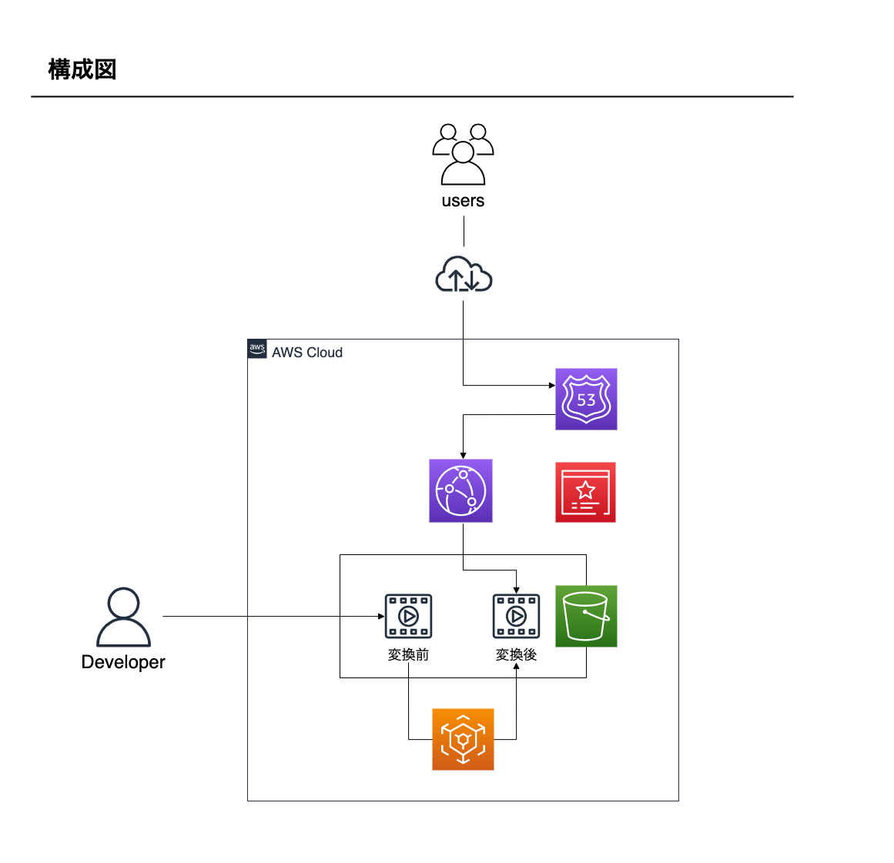

# aws-serverless-ondemand-video-distribution

## 概要

AWS オンデマンド動画配信環境構築(サーバーレス)

## 構成図

## 補足

AWS Elemental MediaConvert箇所については、コンソールにてジョブを作成。

- [AWS Elemental MediaConvert の開始方法](https://docs.aws.amazon.com/ja_jp/mediaconvert/latest/ug/getting-started.html)